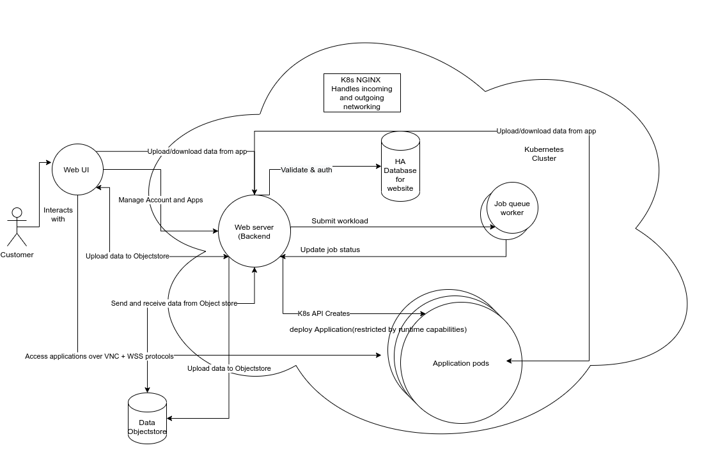

# topiaas
## Introduction 
Topiaas (Top Infrastructure as a Service) is a cloud platform that simplifies the process of renting and deploying applications without the need for manual provisioning. Users can easily select the applications they need along with the desired compute resources, and Topiaas handles the rest through automated orchestration. Once deployed, users are provided with a VNC page that offers low-latency access to these applications directly through their browser, making it feel almost like they are running locally.

While there might be some minor latency compared to running applications on local hardware, the convenience and flexibility of accessing resource-intesive applications on the cloud from any device, at any time, far outweighs this. Additionally, Topiaas follows a pay-as-you-go model, ensuring that users only pay for what they use. This is done by introducing billing units which are calculated by how much CPU/Memory is rented for how much time.

The entire project is opensource and can be self-hosted anywhere thanks to the cloud-agnostic nature of the architecture.
## Infrastructure

## Architecture

## devenv dependencies 

Make sure to have the following packages installed and configured according to your distribution: 

1. docker (make sure to have your user in docker group. follow this tutorial: https://docs.docker.com/engine/install/linux-postinstall/)
2. minikube 
3. kubectl 

